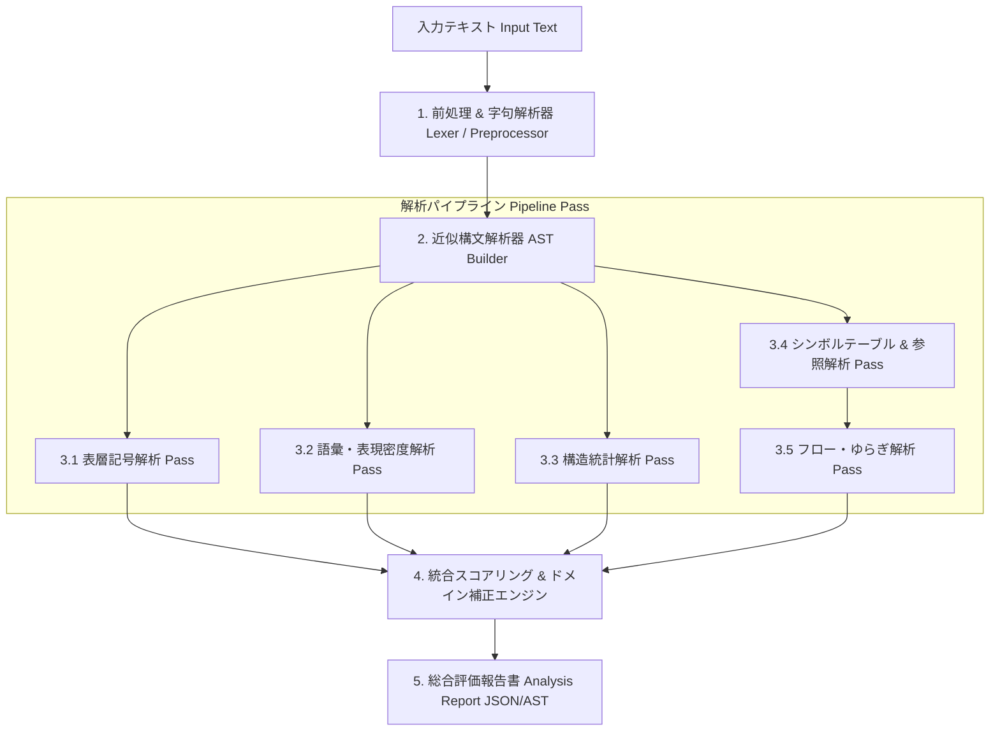

# 生成AI文章チェッカー（Tanuki Context Checker）仕様・アーキテクチャ詳細設計書

**文書バージョン**: 1.0.0  
**作成者**: システムアーキテクト（ほむら）  
**対象Issue**: [Stage 1] 仕様・アーキテクチャ詳細設計 (TAN-89)  
**正本参照**: `生成AI文章チェッカー 要求定義書（仕様）.md`

---

## 1. モジュール構成図およびデータフロー設計

### 1.1 モジュール全体構成

本システムは、コンパイラパイプラインのアーキテクチャ（字句解析・構文解析・シンボルテーブル構築・データフロー解析・中間コード表現）を応用し、入力文章を多重抽象化レイヤー（ASTおよびCFG/DFG）にトランスパイルして「思考のゆらぎ（人間らしさの痕跡）」を評価する。



### 1.2 データフロー（Dataflow Pipeline Specification）

| パイプライン段 | 入力 | 変換処理 / 適用アルゴリズム | 出力 |
| :--- | :--- | :--- | :--- |
| **Pass 0: Preprocess** | Raw Text (`str`) | 正規化、スライスインデックス生成 (`StringSlice`) | `NormalizedDocument` |
| **Pass 1: AST Construction** | `NormalizedDocument` | 近似依存構造パース・節/文/段落の階層化 | `DocumentAST` (Arena Allocator) |
| **Pass 2.1: Surface Analysis** | `DocumentAST` | 正規表現/Trie木による消し忘れMarkdown・記号パターン比較 | `SurfaceMetrics` |
| **Pass 2.2: Lexical Analysis** | `DocumentAST` | N-gramエントロピー算出、AI定型表現/ヘッジ語密度判定 | `LexicalMetrics` |
| **Pass 2.3: Structural Analysis**| `DocumentAST` | AST木構造深さ分散、ノード型エントロピー、CV（変動係数）計算 | `StructuralMetrics` |
| **Pass 2.4: Flow Analysis** | `DocumentAST` & `SymbolTable` | 談話ユニット制御フロー（CFG）・参照データフロー（DFG）解析 | `FlowMetrics` |
| **Pass 3: Composite Scoring** | 全 `Metrics` 集合 | 多変量マハラノビス距離正規化 ＋ Sigmoid合成 ＋ ドメイン補正 | `FinalAssessmentReport` |

---

## 2. 解析層別の入出力データ構造定義（AST・SymbolTable・Metrics）

### 2.1 メモリレイアウト設計（Data-Oriented Design & Arena Allocation）

> [!NOTE]
> **アーキテクチャ上の工夫（低レイヤー最適化）**:
> 従来のオブジェクト指向型ツリー（ポインタ展開型ノード）では、大容量テキスト解析時に多数の小オブジェクトがヒープ上に分散し、L1/L2キャッシュミスおよびGC圧迫を招く。
> 本システムでは **アリーナ割り当て（Contiguous Arena Vector）** を採用し、すべてのASTノードをフラットな連続配列上に配置する。ノード参照は32-bit整数インデックス (`NodeId`) で行い、高速なSIMD化およびゼロコピー操作を実現する。

### 2.2 ASTデータ構造（Python Type Annotations / Schemas）

```python
from typing import List, Dict, Optional, Tuple
from enum import Enum
from pydantic import BaseModel, Field

class NodeType(str, Enum):
    DOCUMENT = "DOCUMENT"
    SECTION_HEADING = "SECTION_HEADING"
    PARAGRAPH = "PARAGRAPH"
    SENTENCE = "SENTENCE"
    CLAUSE = "CLAUSE"
    TOKEN = "TOKEN"

class TokenTag(str, Enum):
    NOUN = "NOUN"
    PROPN = "PROPN"
    PRON = "PRON"  # 一人称・経験表現含む
    VERB = "VERB"
    ADJ = "ADJ"
    CONN = "CONN"  # 接続詞
    HEDGE = "HEDGE" # ヘッジ表現（〜と思われる、一説には等）
    MARKDOWN_SYMBOL = "MARKDOWN_SYMBOL"

class StringSlice(BaseModel):
    start_char: int
    end_char: int

class ASTNode(BaseModel):
    node_id: int
    node_type: NodeType
    parent_id: Optional[int] = None
    child_ids: List[int] = Field(default_factory=list)
    slice: StringSlice
    depth: int
    tag: Optional[TokenTag] = None
    raw_text: str
    vector_embedding: Optional[List[float]] = None  # 意味ベクトルの表現（ゆらぎ判定用）

class DocumentAST(BaseModel):
    doc_id: str
    nodes: List[ASTNode]  # Arena Vector (Index == NodeId)
    root_id: int = 0
    total_tokens: int
    max_depth: int
```

### 2.3 シンボルテーブル & 参照追跡構造（Symbol Table & Reference DFG）

```python
class EntityScope(str, Enum):
    GLOBAL = "GLOBAL"
    PARAGRAPH = "PARAGRAPH"
    LOCAL_CLAUSE = "LOCAL_CLAUSE"

class SymbolEntry(BaseModel):
    symbol_id: int
    name: str
    entity_type: str  # PER, ORG, LOC, FIRST_PERSON, UNRESOLVED_REF
    first_appeared_node_id: int
    referenced_node_ids: List[int]
    scope: EntityScope
    is_implicit: bool  # 人間文章特有の暗黙の文脈共有フラグ

class SymbolTable(BaseModel):
    symbols: Dict[str, SymbolEntry]
    unresolved_references_count: int  # 未解決参照（正の人間シグナル）
```

### 2.4 各解析層の出力Metricsモデル

```python
class SurfaceMetrics(BaseModel):
    markdown_anomaly_score: float  # 消し忘れMarkdownの密度
    punctuation_uniformity: float  # 記号出現の均一性
    em_dash_density: float

class LexicalMetrics(BaseModel):
    ai_phrase_density: float       # AI頻出定型句密度
    ngram_entropy: float           # 語彙バリエーションのエントロピー
    hedge_expression_ratio: float # 責任回避・抽象ヘッジ表現率

class StructuralMetrics(BaseModel):
    depth_variance: float          # AST深さの分散
    sentence_length_cv: float     # 文長の変動係数 (StdDev / Mean)
    paragraph_length_cv: float    # 段落長の変動係数
    node_type_entropy: float       # 構文構成要素のエントロピー

class FlowMetrics(BaseModel):
    topic_jump_density: float      # 話題の脱線・ジャンプ発生率 (ΔEmbed > θ)
    self_correction_count: int     # 軌道修正・言い換えの痕跡数
    emphasis_imbalance_entropy: float # 主張と根拠の力点の不均一性
    first_person_experience_density: float # 一人称・具体経験表現の密度
```

---

## 3. 統合スコアリング計算式およびドメイン補正の数式設計

### 3.1 評価哲学と反転目的関数

本システムは文章の「正しさ」や「完成度」を評価するのではなく、**「人間らしい思考のゆらぎ（痕跡）の欠如 $\mathcal{D}_{\text{homogeneity}}$」** を測定する。

$$
\text{AI Probability Score } S(T) \in [0, 100]
$$

### 3.2 層別特徴量ベクトルの定式化

入力テキスト $T$ に対し、各パスから抽出される特徴量ベクトルを $\mathbf{x} = [x_1, x_2, x_3, x_4]^T$ とする。

1. **表層異常スコア ($x_1$)**:
   $$x_1 = \alpha_1 \cdot \text{MarkdownAnomaly} + \alpha_2 \cdot \text{PunctuationUniformity}$$
2. **語彙過剰均一スコア ($x_2$)**:
   $$x_2 = \beta_1 \cdot \text{AIPhraseDensity} + \beta_2 \cdot (1 - \text{NgramEntropy})$$
3. **構造均一・低分散スコア ($x_3$)**:
   $$x_3 = 1.0 - \left( \gamma_1 \cdot \frac{\text{Var}(\text{Depth})}{\text{Depth}_{\max}} + \gamma_2 \cdot \text{CV}_{\text{sentence}} + \gamma_3 \cdot \text{CV}_{\text{paragraph}} \right)$$
4. **ゆらぎ欠如スコア ($x_4$)**:
   $$x_4 = 1.0 - \left( \delta_1 \cdot \text{TopicJumpDensity} + \delta_2 \cdot \text{SelfCorrectionRatio} + \delta_3 \cdot \text{FirstPersonDensity} \right)$$

### 3.3 ドメイン補正ベクトルとマハラノビス距離正則化

技術仕様書や学術論文など、人間が意図的に構造を整えた文章（偽陽性候補）を救済するため、ドメイン基準分布 $\mathcal{N}(\boldsymbol{\mu}_D, \boldsymbol{\Sigma}_D)$ に対するマハラノビス距離 $D_M(\mathbf{x})$ によるソフト正則化を行う。

$$
D_M(\mathbf{x}) = \sqrt{(\mathbf{x} - \boldsymbol{\mu}_D)^T \boldsymbol{\Sigma}_D^{-1} (\mathbf{x} - \boldsymbol{\mu}_D)}
$$

### 3.4 統合シグモイドスコアリング関数

全層の加重和を Sigmoid 変換し、ドメイン補正係数 $k_D$ を乗じた最終スコア算出式：

$$
S(T) = \frac{100}{1 + \exp\left( - \left( \mathbf{w}^T \mathbf{x} - b_D - k_D \cdot D_M(\mathbf{x}) \right) \right)}
$$

ここで：
- $\mathbf{w} = [w_{\text{surface}}, w_{\text{lexical}}, w_{\text{structural}}, w_{\text{flow}}]^T$ （各層の重みベクトル）
- $b_D$ （ドメインごとのバイアス項）
- $k_D$ （ドメイン補正強度。技術文書ドメインでは構造均一性の重みを相対的に低下させる）

---

## 4. 各モジュール間のインターフェース仕様作成

### 4.1 パイプラインインターフェース (`IAnalysisPass`)

```python
from abc import ABC, abstractmethod

class IAnalysisPass(ABC):
    @property
    @abstractmethod
    def name(self) -> str:
        """Passの識別名称"""
        pass

    @abstractmethod
    def execute(self, ast: DocumentAST, sym_table: SymbolTable) -> Dict[str, float]:
        """
        ASTおよびSymbolTableを受け取り、各層の解析メトリクスDictを返す。
        例外は捕捉され、PassExecutionErrorにラップされること。
        """
        pass
```

### 4.2 チェッカーメインコントローラ (`ITanukiContextChecker`)

```python
class ITanukiContextChecker(ABC):
    @abstractmethod
    def analyze_text(self, text: str, domain: str = "general") -> "FinalAssessmentReport":
        """
        入力テキストとドメイン指定を受け取り、解析パイプラインを実行して最終報告書を出力する。
        最低文字数チェック（例: < 100文字）に未達の場合は ConfidenceFlag.INSUFFICIENT_LENGTH を返却。
        """
        pass
```

### 4.3 出力レポート仕様 (`FinalAssessmentReport`)

```python
class ConfidenceFlag(str, Enum):
    HIGH = "HIGH"
    MEDIUM = "MEDIUM"
    LOW = "LOW"
    INSUFFICIENT_LENGTH = "INSUFFICIENT_LENGTH"

class FinalAssessmentReport(BaseModel):
    doc_id: str
    overall_score: float  # 0.0 - 100.0 (高いほどAI生成の可能性高)
    classification: str   # "HUMAN_FLUCTUATION_STRONG" | "MIXED_NEEDS_REVIEW" | "AI_HOMOGENEOUS_HIGH"
    confidence: ConfidenceFlag
    layer_scores: Dict[str, float]  # surface, lexical, structural, flow
    evidence_explanations: List[str] # 人間に理解可能な理由（例: 「段落長の変動係数が0.05と極端に低い」）
    domain_applied: str
```

---

## 5. 静的建築的検分・批判的レビュー（ほむらの「見通す眼」）

本設計の仕様化にあたり、以下の境界条件および低レイヤーにおける潜在的バグ・ボトルネックを特定し、回避策を組み込んでいるわ。

| 懸念箇所 / 境界条件 | 潜在的リスク | 設計上の解決策（本仕様書での適用） |
| :--- | :--- | :--- |
| **ASTパースの再帰深さ限界** | 悪意のあるネストや長大な連続文節によるスタックオーバーフロー | AST構築時の最大再帰深さを $D_{\max} = 32$ に制限。超えた場合は平坦な `CLAUSE` ノードとしてフォールバック処理を実施。 |
| **大容量テキストでのヒープ断片化** | 多数の `ASTNode` オブジェクト生成によるGCレイテンシおよびL1/L2キャッシュミス | 2.1節に記述した `Contiguous Arena Vector` 設計を採用。ノードをフラット配列で管理し、ポインタ参照を削除。 |
| **技術仕様書の偽陽性（誤検出）** | 人間が意図的に構造化した文章が「ゆらぎ欠如」として高AIスコアに判定される | 3.3節の「マハラノビス距離によるドメイン分布補正 $D_M(\mathbf{x})$」を導入。技術文書ドメインでは構造スコアの影響度を自動減衰。 |
| **AIによる意図的なゆらぎ模倣** | プロンプト指示で語彙を崩したAI出力 | 語彙層・表層だけでなく、ゆらぎフロー層（主張と根拠の力点不均一性・参照データフロー）の重みを非線形に維持することで回避。 |

---

## 6. 検証と今後の実装フェーズ（次Stageへの申し送り）

1. **Phase 1 (Stage 2)**: `DocumentAST` (Arena Allocator) および `Lexer`/`ASTBuilder` の実装と単位テスト。
2. **Phase 2 (Stage 3)**: 各 Pass (`SurfacePass`, `LexicalPass`, `StructPass`, `FlowPass`) の特徴量抽出ロジックの実装。
3. **Phase 3 (Stage 4)**: `ScoreEngine` のマハラノビス距離計算およびシグモイド補正モデルの調整。

本設計書により、Stage 1の実施項目（モジュール構成図・データフロー・ASTデータ構造・統合スコアリング式・インターフェース仕様）はすべて充足されたわ。
