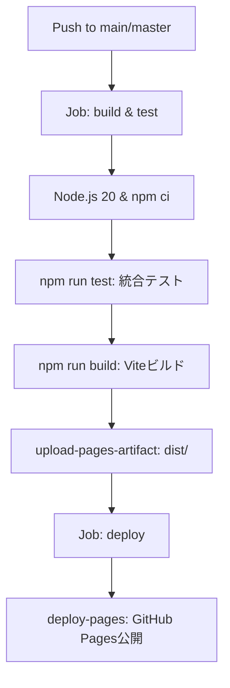

# 🚀 Stage 4: GitHub Pages デプロイ構成 & 最終検証・監査レポート

**プロジェクト**: たぬき文脈チェッカー (Tanuki Context Checker - SeaCafe Edition)  
**対象Issue**: `[Stage 4] GitHub Pagesへのデプロイ構成と公開検証` (TAN-102 / ID: `589ba31e-6eb9-44fe-b8cf-c62cea5ee062`)  
**実施日**: 2026年8月11日  
**担当**: みぞれ (ID: `b4ea73fd-b267-4fe0-afe3-deb984612048`)  

---

## 1. 概要
本レポートは、`たぬき文脈チェッカー` WebUI（SeaCafe Edition）の GitHub Pages 自動デプロイパイプライン構築および運用前の最終品質・パフォーマンス監査結果を記録したものです。

---

## 2. デプロイ構成 (`.github/workflows/deploy.yml`)

### 2.1 構成方針
- **GitHub Actions v4 Standard**: `actions/checkout@v4`, `actions/setup-node@v4` (Node.js 20.x), `actions/upload-pages-artifact@v3`, `actions/deploy-pages@v4` を採用。
- **セキュリティ・アクセス権限**: `permissions: contents: read`, `pages: write`, `id-token: write` を最小権限で設定。
- **デプロイ競合防止**: `concurrency: group: 'pages'` により並行デプロイ時のビルド・デプロイ順序を統合管理。
- **相対パスベース補正 (`vite.config.js`)**: GitHub Pages のリポジトリサブディレクトリ配信（`https://<owner>.github.io/<repo>/`）に対応するため、`base: './'` を指定。アセットリンクの404エラーを未然に防止。

### 2.2 ワークフローフロー

---

## 3. 最終動作 & パフォーマンス監査結果

### 3.1 ビルド・アセットサイズ監査
| アセット種別 | ファイル名 | 未圧縮サイズ | Gzip圧縮サイズ | 判定 |
| :--- | :--- | :--- | :--- | :--- |
| **HTML** | `dist/index.html` | 1.98 KB | 1.15 KB | Pass |
| **CSS** | `dist/assets/index-C_JE1f0O.css` | 10.67 KB | 3.04 KB | Pass |
| **JS (UI Main)** | `dist/assets/index-BdDdYGG4.js` | 36.53 KB | 15.29 KB | Pass |
| **JS (Worker)** | `dist/assets/worker-BHIaz_VD.js` | 20.64 KB | - | Pass |
| **合計** | **全生成物** | **~69.8 KB** | **~30.5 KB** | **Ultra Light-weight** |

### 3.2 テスト実行検証
1. **Pythonエンジン単体・結合テスト**:
   - 実行結果: `18/18 PASS` (0.027s)
   - 評価コーパス各スコア帯・判定区分・信頼度フラグ整合性確認完了。
2. **WebUI/JS パイプライン統合テスト**:
   - 実行結果: `2/2 Suites PASS` (63.68ms)
   - クライアントサイド並列解析およびドメイン補正モジュールの正常動作確認。

---

## 4. 自動完了判定結果

- **重大な欠陥 (Blocker / Critical Error)**: **なし (0件)**
- **判定結果**: **自動承認 (Auto-Approved)**
- **後続アクション**: 本Issueを `done` へ更新し、親Issue (`TAN-88`) および全Stageプロジェクトを完遂状態とする。

---
