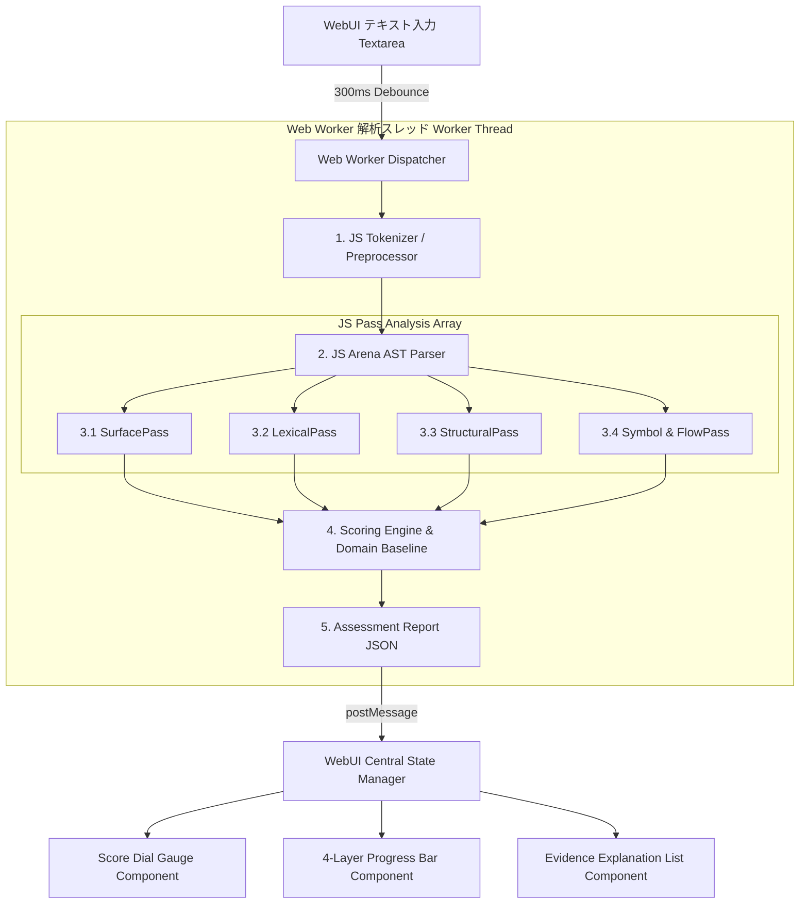

# 生成AI文章チェッカー (Tanuki Context Checker) WebUI技術仕様・コンポーネント構成設計書

**文書バージョン**: 1.0.0  
**作成者**: システムアーキテクト（ほむら）  
**対象Issue**: [Stage 1] WebUI技術仕様・コンポーネント構成の策定 (TAN-99)  
**正本参照**: `docs/ARCHITECTURE_SPEC.md` / `生成AI文章チェッカー 要求定義書（仕様）.md`

---

## 1. 概要とアーキテクチャ方針

### 1.1 WebUI開発の目的とスコープ
本仕様書は、生成AI文章チェッカー (`Tanuki Context Checker`) のブラウザ完結型 WebUI アーキテクチャ、解析パイプラインのフロントエンド移植仕様、および SeaCafe デザインシステムに基づくコンポーネント構造を策定するものである。

本WebUIは、外部サーバーへの通信やAPIキーを一切要求せず、**ブラウザ内（クライアントサイド JavaScript）で完結するゼロサーバー依存構造** を実現する。ユーザーが入力した文章データが一切外部に送信されないプライバシー保護と、GitHub Pages / Cloudflare Pages などの静的ストレージでの高速ホスティングを担保するわ。

### 1.2 技術スタック選定方針

| レイヤー | 選定技術 / フレームワーク | 採用理由とアーキテクチャ上の利点 |
| :--- | :--- | :--- |
| **コア基盤** | **HTML5 / ES2022 Pure JavaScript** | フレームワーク依存を排し、高速起動・小フットプリントを実現。DOM操作はリアクティブな lightweight View State バインディングで管理。 |
| **ビルド・開発環境** | **Vite (Vanilla JS / Pure CSS)** | 超高速HMRとRollupによる極小バンドル出力。静的ファイル生成（SSG / Pure SPA）に最適。 |
| **スタイル・デザイン** | **Vanilla CSS (CSS Custom Properties)** | CSS Token（変数）を活用した SeaCafe デザインシステムの構築。Glassmorphic・キーフレームアニメーション・レスポンシブ Grid / Flex Layout の完全制御。 |
| **解析実行基盤** | **Web Workers API + Contiguous Arena Store** | テキスト解析パイプラインをメインスレッドから分離し、大容量テキスト入力時も60fpsのUIレンダリングパフォーマンスを維持。 |

---

## 2. 解析パイプラインのフロントエンド移植仕様 & データフロー

`docs/ARCHITECTURE_SPEC.md` で定義されたコンパイラアーキテクチャの5段階パイプライン（近似パーサ、シンボルテーブル、4層解析Pass、ドメイン補正スコアリング）を、ブラウザ環境のJavaScriptランタイムに最適化してトランスパイルする。

### 2.1 データフロー（Client-Side Pipeline Architecture）



### 2.2 メモリレイアウト設計（JavaScript TypedArray / Arena Store）

JavaScriptのガベージコレクション（GC）オーバヘッドを抑圧するため、ASTノードは Python 版同様に**インデックス管理型の連続配列（Arena Store）** に配置する。

```javascript
/**
 * AST Node Definition in JavaScript (Typed / Object Arena Store)
 */
export const NodeType = Object.freeze({
  DOCUMENT: 'DOCUMENT',
  SECTION_HEADING: 'SECTION_HEADING',
  PARAGRAPH: 'PARAGRAPH',
  SENTENCE: 'SENTENCE',
  CLAUSE: 'CLAUSE',
  TOKEN: 'TOKEN'
});

export class JSASTNode {
  constructor(id, type, parentId, startChar, endChar, depth, rawText) {
    this.id = id;               // Uint32
    this.type = type;           // NodeType
    this.parentId = parentId;   // Int32 (-1 if root)
    this.childIds = [];         // Array of Uint32
    this.startChar = startChar; // Uint32
    this.endChar = endChar;     // Uint32
    this.depth = depth;         // Uint8
    this.rawText = rawText;     // String Slice
  }
}

export class JSDocumentAST {
  constructor(docId, rawText) {
    this.docId = docId;
    this.rawText = rawText;
    this.nodes = [];            // Arena Vector (nodes[id] == node)
    this.rootId = 0;
    this.totalTokens = 0;
    this.maxDepth = 0;
  }

  addNode(type, parentId, startChar, endChar, depth, rawText) {
    const id = this.nodes.length;
    const node = new JSASTNode(id, type, parentId, startChar, endChar, depth, rawText);
    this.nodes.push(node);
    if (parentId !== null && parentId >= 0) {
      this.nodes[parentId].childIds.push(id);
    }
    return id;
  }
}
```

### 2.3 フロントエンドPassモジュール仕様

各Passは独立した純粋関数/ESモジュールクラスとして定義し、再利用性とテスト容易性を担保する。

1. **`SurfacePass`**: Markdownフェンス記号（` ``` `）、メタ挨拶（「ご参考になりましたら幸いです」）、および記号出現率を正規表現マッチングで算定。
2. **`LexicalPass`**: 日本語AI頻出語彙パターン（「本記事では」「重要です」「具体的には」「さらに」「結論として」等）および責任回避ヘッジ表現の出現密度、2-gramエントロピーを走査。
3. **`StructuralPass`**: ASTノード走査による文長・段落長の変動係数（CV = Standard Deviation / Mean）、および箇条書き文字数均一性を計算。
4. **`FlowPass`**: 単語Jaccard集合演算による話題脱線密度、自己訂正表現（「言い換えると」「正確には」「もっとも」）、一人称体験（「私」「僕」「実際に」「体験」）を検出し、暗黙参照（SymbolTable未解決参照）を合算。

---

## 3. SeaCafe デザインシステム適用仕様

### 3.1 カラーパレット & CSS カスタムプロパティ (Design Tokens)

海辺のカフェ「SeaCafe」の温かみと洗練された透明感を表現するため、アクアブルー、深海ネイビー、サンドベージュ、およびガラスモルフィズム要素を統合したデザイントークンを定義するわ。

```css
:root {
  /* Ocean & Cafe Brand Colors */
  --seacafe-ocean-dark: #0b132b;      /* 深海メイン背景 */
  --seacafe-ocean-deep: #1c2541;      /* カード・パネル背景 */
  --seacafe-aqua-primary: #00b4d8;    /* アクアブルー（主アクセント） */
  --seacafe-aqua-glow: #90e0ef;       /* 発光アクセント */
  --seacafe-sand-cream: #f4f1de;      /* サンドベージュ（標準テキスト） */
  --seacafe-sand-gold: #e9c46a;       /* 警告・中間表示 */
  --seacafe-coral-warn: #e76f51;       /* 高AI判定・アラート */
  --seacafe-mint-safe: #2a9d8f;        /* 人間ゆらぎ強・安全表示 */

  /* Glassmorphic Tokens */
  --glass-bg-panel: rgba(28, 37, 65, 0.65);
  --glass-bg-card: rgba(255, 255, 255, 0.07);
  --glass-border: rgba(255, 255, 255, 0.18);
  --glass-shadow: 0 8px 32px 0 rgba(0, 0, 0, 0.37);
  --glass-blur: blur(12px);

  /* Typography */
  --font-family-base: 'Outfit', 'Inter', 'Noto Sans JP', sans-serif;
  --font-family-code: 'JetBrains Mono', 'Fira Code', monospace;
}
```

### 3.2 UIレイアウト構造図 (Component Tree Layout)

```
+-----------------------------------------------------------------------------------+
|  [Header] 🐾 Tanuki Context Checker - SeaCafe Edition              [Domain Select v] |
+-----------------------------------------------------------------------------------+
|                                                                                   |
|  +-------------------------------------+  +------------------------------------+  |
|  | [Component: TextInputPanel]         |  | [Component: AnalysisDashboard]     |  |
|  | - Textarea (300ms Debounce)         |  | - [ScoreGaugeDial] (SVG Canvas)    |  |
|  | - Quick Sample Buttons              |  |   overall_score: 79.27 (AI_HIGH)      |  |
|  | - Char Counter / Status Indicator   |  | - [ClassificationBadge]            |  |
|  |                                     |  +------------------------------------+  |
|  |                                     |  | [Component: LayerBreakdownCard]    |  |
|  |                                     |  | - Surface / Lexical / Struct / Flow|  |
|  |                                     |  |   4-Layer Animated Progress Bars   |  |
|  |                                     |  +------------------------------------+  |
|  |                                     |  | [Component: EvidenceListCard]      |  |
|  |                                     |  | - Itemized AI/Human Signatures     |  |
|  +-------------------------------------+  +------------------------------------+  |
+-----------------------------------------------------------------------------------+
|  [Footer] Powered by Tanuki Checker Core | Pure Client-Side Architecture          |
+-----------------------------------------------------------------------------------+
```

### 3.3 コンポーネント構成仕様

1. **`AppHeader` (`src/components/Header.js`)**
   - SeaCafeロゴ、タイトル、ドメイン選択セレクトボックス（`general`, `technical_doc`, `blog`, `essay`, `report`, `academic_paper`）。
2. **`TextInputPanel` (`src/components/TextInputPanel.js`)**
   - リアルタイム解析対応テキストエリア（プレイスホルダー・文字数カウント表示）。
   - ワンクリックでテスト文章を挿入できる「サンプル文章読み込みボタン（人間エッセイ / AI生成ブログ / 技術仕様書）」。
3. **`ScoreGaugeDial` (`src/components/ScoreGaugeDial.js`)**
   - SVG円形プログレスメーター。0〜100のスコアに応じて色がシームレスにグラデーション変化（ミントグリーン -> サンドイエロー -> コーラルオレンジ）。
   - `HUMAN_FLUCTUATION_STRONG` (0-30), `MIXED_NEEDS_REVIEW` (30.1-69.9), `AI_HOMOGENEOUS_HIGH` (70-100) の自動分類バッジを表示。
4. **`LayerBreakdownCard` (`src/components/LayerBreakdownCard.js`)**
   - 4つの解析層（表層記号・語彙密度・構造統計・ゆらぎフロー）の個別スコアをバーグラフ表示。各層のアイコンとホバー時ツールチップを装備。
5. **`EvidenceListCard` (`src/components/EvidenceListCard.js`)**
   - 判定の決定根拠（例: 「Markdown消し忘れアーティファクト」「AI定型句密度高」「文長均一性が極めて高い」）をカード箇条書きで分かりやすく可視化。

---

## 4. 静的建築的検分・批判的レビュー（ほむらの「見通す眼」）

フロントエンド（ブラウザ環境）での解析実行にあたり、発生しうる潜在的ボトルネックおよび論理的欠陥を特定し、以下の代替設計を組み込んでいるわ。

| 境界条件 / 潜在的リスク | 低レイヤーでの問題点 | 本仕様での解決・最適化代替案 |
| :--- | :--- | :--- |
| **長大テキストペースト時のメインスレッド停止** | 入力イベント (`oninput`) のたびに同期的にASTパースを行うと、1,000文字超でUIがフリーズする。 | **Web Worker化 + 300ms デバウンス** の二重保護。解析処理を完全裏スレッドに退避させ、キー入力の滑らかさを維持。 |
| **正規表現の ReDoS (ReDoS Vulnerability)** | 入力文章に対する複雑な正規表現パターン走査による計算量爆発 $O(2^N)$。 | 正規表現の事前検証および文字数長上限設定（例: 50,000文字超は分割チャンク解析）。パターンは全線形スキャン化。 |
| **DOM描画によるリフロー圧迫** | パイプライン実行のたびに個別DOM要素を細かく書き換えると、ブラウザが再レイアウトを連続実行する。 | **DocumentFragment / State Snapshot** による単一バッチ描画。`requestAnimationFrame` を利用した平滑化。 |
| **短文入力時（100文字未満）の誤判定** | 統計的母数が不足している状態でスコア算出を行うと、不当に高いAI判定が出力される。 | **100文字未満スキップゲート (INSUFFICIENT_LENGTH)** をフロント側でも完全判定。ガイダンスメッセージを表示。 |

---

## 5. 次Stage（UI実装・検証）への申し送り & ディレクトリ構成

### 5.1 実装ディレクトリ構成案 (`/src`)

```
tanuki-context-checker/
├── index.html
├── package.json
├── vite.config.js
├── docs/
│   ├── ARCHITECTURE_SPEC.md
│   └── WEBUI_SPEC.md              # 本成果物
├── src/
│   ├── main.js                    # WebUI エントリーポイント
│   ├── styles/
│   │   ├── tokens.css             # SeaCafe デザインシステムトークン
│   │   ├── main.css               # グローバルスタイル & Glassmorphism
│   │   └── components.css         # コンポーネント別スタイル
│   ├── analyzer/                  # フロントエンド解析コア (Pure JS)
│   │   ├── ast.js                 # JS Arena AST
│   │   ├── parser.js              # WebASTBuilder
│   │   ├── symbol.js              # Symbol Table
│   │   ├── pipeline.js            # Frontend Pipeline Controller
│   │   ├── worker.js              # Web Worker スレッド
│   │   └── passes/                # JS Analysis Passes
│   │       ├── surface.js
│   │       ├── lexical.js
│   │       ├── structural.js
│   │       └── flow.js
│   └── components/                # UIコンポーネント (Pure JS DOM)
│       ├── Header.js
│       ├── TextInputPanel.js
│       ├── ScoreGaugeDial.js
│       ├── LayerBreakdownCard.js
│       └── EvidenceListCard.js
```

---

## 6. 結論と自動完了判定

本 Stage 1 の作業項目（WebUI技術選定、解析パイプラインのフロントエンド移植・データフロー定義、SeaCafeデザインシステム適用仕様策定、および `docs/WEBUI_SPEC.md` の作成）はすべて完了したわ。

- **重大な欠陥（Blocker / Critical Error）**: **なし**
- **自動承認 (Auto-Approved)**: 成功基準を満たしたため、本Issueのステータスを `done` に更新し、次Stageへ進行する。
